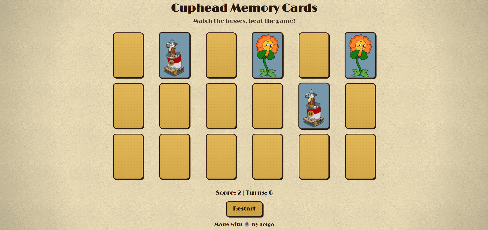

# Cuphead Memory Cards

A web-based **memory card matching game** inspired by the Cuphead
universe. The goal is simple: flip cards, match pairs of bosses, and
beat the game in as few turns as possible.

## 🔗 Live Demo

Play it here: **https://tolgab35.github.io/cuphead-memory-cards/**

## 🖼️ Preview



## 🎮 Features

- Flip-to-match memory card gameplay
- Dynamic grid layout with responsive design
- Randomized deck on each restart
- Score tracking (matched pairs)
- Turn counter (moves made)
- Restart button for quick replays
- Retro-themed visuals with custom Cuphead boss artwork

## 🛠️ Technologies Used

- **HTML5** -- Structure of the game
- **CSS3** -- Styling, animations, responsive design
- **Vanilla JavaScript** -- Game logic and interactions
- **JSON** -- Card data storage

## 📂 Project Structure

    CUPHEAD-MEMORY-CARDS
    │── assets/
    │   ├── cards/           # Card images (Cuphead bosses)
    │   ├── favicon.png      # Favicon
    │   └── grain.jpg        # Background texture
    │── data/
    │   └── cards.json       # Card metadata
    │── index.html           # Main HTML file
    │── style.css            # Styling
    │── script.js            # Game logic
    │── LICENSE              # License file
    │── README.md            # Project readme

## 📦 Installation & Usage

Clone the repository and open `index.html` in your browser:

```bash
git clone https://github.com/tolgab35/cuphead-memory-cards.git
cd cuphead-memory-cards
open index.html
```

Or simply use the live demo above.

## 🎯 Future Improvements

- Custom modal popup at game end (instead of default JS alert)
- Difficulty levels (more/less cards)
- Timer for speedruns
- Themed card back designs
- Sound effects & background music
- Mobile touch optimization
- Accessibility improvements (keyboard navigation, ARIA support)

## 🤝 Contributing

Contributions, ideas, and feedback are welcome! To contribute:

1. Fork the repository
2. Create a new branch (`git checkout -b feature/YourFeature`)
3. Commit your changes (`git commit -m 'Add some feature'`)
4. Push to the branch (`git push origin feature/YourFeature`)
5. Open a Pull Request

## 📜 License

This project is licensed under the MIT License. Feel free to use and
modify it.

## 🙏 Credits & Disclaimer

Cuphead and related characters are © Studio MDHR. This is a fan-made,
non-commercial project for educational purposes.

---

Made with ☕ by [Tolga](https://github.com/tolgab35)
